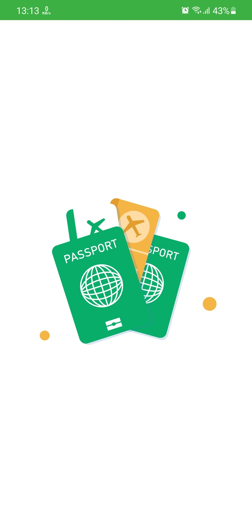
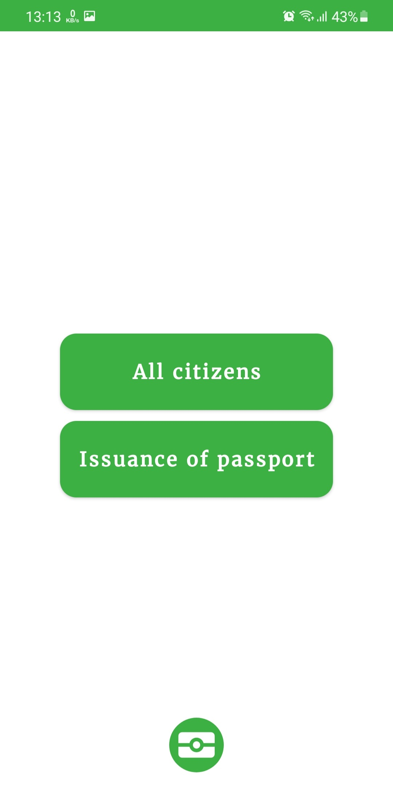
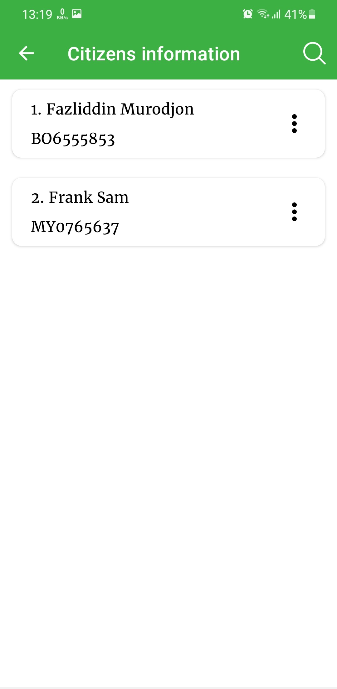
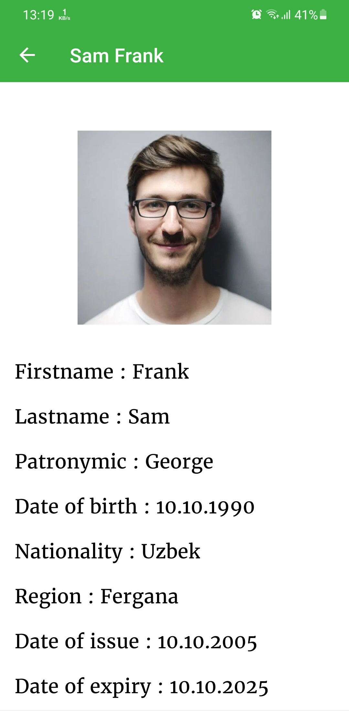
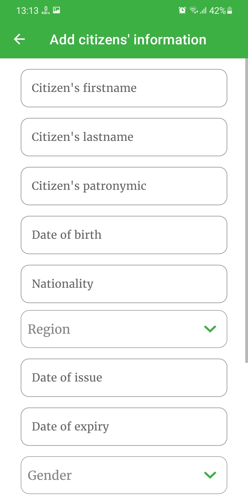
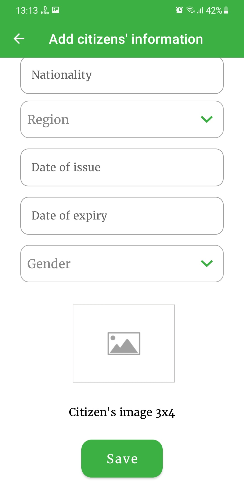
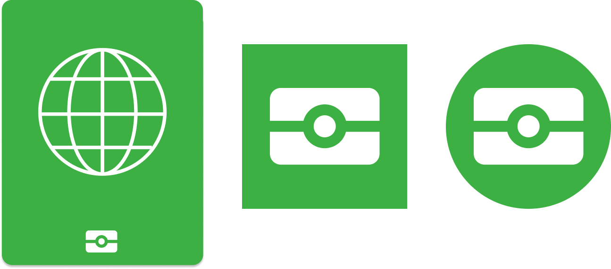

# Passport Data Generation

    
  
 

<h3>I made icons for this app.<h3>

# Resources:
 
<a href = "https://lottiefiles.com/90246-saudi-passport">LottieFiles</a>

<a href = "https://www.figma.com/file/538sW6zF9GBfasT1ZzEFhH/IT-Courses?node-id=0%3A1">Figma</a>

